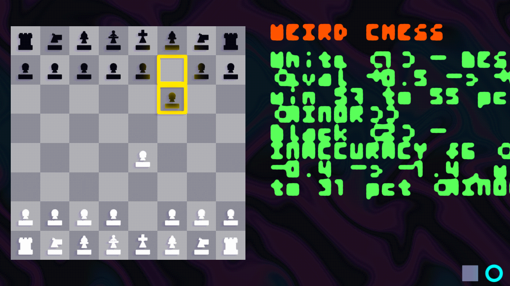

# Weird Chess 

An experimental chess game built on **[weird-engine](https://github.com/damacaa/weird-engine)** (a 2D signed distance field ray-marching engine). 



**Weird Chess** pairs a full chess game with an evolving narrative panel:
- **Left Panel:** The interactive chessboard, smooth SDF piece rendering, move animations, legal move indicators, promotion modal, and game controls.
- **Right Panel:** A real-time story stream powered by an embedded local LLM (`llama.cpp`), dynamically turning tactical swings, captures, and blunders into an unfolding serialized drama (with automatic fallback to technical move annotations if no model is loaded).

```
+-----------------------------------------+-----------------------------------------+
|                                         |  WEIRD CHESS                            |
|                                         |                                         |
|                                         |  "What are you playing? What are        |
|   8  [r] [.] [b] [q] [k] [b] [.] [r]    |   you chewing?"                         |
|   7  [p] [p] [p] [.] [.] [p] [p] [p]    |                                         |
|   6  [.] [.] [.] [.] [.] [.] [.] [.]    |  Rowan stepped forward to claim open    |
|   5  [.] [.] [.] [p] [.] [.] [.] [.]    |  ground. Vane advanced their frontline  |
|   4  [.] [.] [.] [P] [.] [.] [.] [.]    |  presence.                              |
|   3  [.] [.] [N] [.] [.] [.] [.] [.]    |                                         |
|   2  [P] [P] [P] [.] [P] [P] [P] [P]    |                                         |
|   1  [R] [.] [B] [Q] [K] [B] [.] [R]    |                                         |
|       a   b   c   d   e   f   g   h     |                                         |
|                                         |                                         |
|                                         |                                  [■] [○]|
+-----------------------------------------+-----------------------------------------+
```

---

## Table of Contents

- [Features](#features)
- [Architecture & Design](#architecture--design)
- [Libraries & External Dependencies](#libraries--external-dependencies)
- [Threading & Execution Lifecycle](#threading--execution-lifecycle)
- [Project Layout](#project-layout)
- [Building and Running](#building-and-running)
  - [Prerequisites](#prerequisites)
  - [Build Steps](#build-steps)
  - [Stockfish Engine Setup (Optional)](#stockfish-engine-setup-optional)
- [Controls](#controls)
- [Configuration & Difficulty Tuning](#configuration--difficulty-tuning)
- [Local LLM Story Narrator](#local-llm-story-narrator)
- [Automated Tests & Debugging](#automated-tests--debugging)
- [Licenses](#licenses)

---

## Features

- **2D SDF Ray-Marched Graphics:** Board squares, pieces, highlights, and buttons are defined as Signed Distance Fields and ray-marched with crisp vector-like edges and procedural materials.
- **Embedded Local LLM Narrator:** Uses `llama.cpp` to narrate matches as serialized fiction in real time. Chess moves and tactical events drive character actions, rivalries, and dramatic tension without explicitly mentioning chess pieces.
- **Asynchronous Move Classification:** Fast centipawn loss and tactical analysis performed on a background worker thread without stalling piece animations or the render loop.
- **Tactic Detection Engine:** Real-time bitboard analysis detecting forks, absolute & relative pins, skewers, discovered attacks, checks, and mates.
- **Built-in In-Process Engine (`MinimaxAI`):** High-performance C++20 Alpha-Beta search with PeSTO tapered piece-square evaluation and Quiescence search. Runs 100% in-process out of the box and compiles directly to WebAssembly for web builds.
- **Optional Stockfish UCI Support:** Subprocess adapter for Stockfish with humanized Elo tuning (shallow search depth, dynamic blunders, Elo limits).
- **Responsive Layout System:** Dynamic resolution tracking and auto-reframing for arbitrary window sizes.
- **Typewriter Text Pacing:** Smooth character-by-character text reveal with dynamic catch-up acceleration.
- **Modular ECS Architecture:** Thin scene dispatcher registering decoupled, single-responsibility systems.

---

## Architecture & Design

Weird Chess is built around clean boundaries and an Entity-Component-System (ECS) pattern. The board state in `chess.hpp` is the single source of truth, while ECS entities act as a visual mirror.

```
                  ┌───────────────────────────────┐
                  │    ChessLibBoard (chess.hpp)  │  <-- Single Source of Truth
                  └──────────────┬────────────────┘
                                 │
           ┌─────────────────────┼─────────────────────┐
           ▼                     ▼                     ▼
┌─────────────────────┐ ┌─────────────────┐ ┌─────────────────────┐
│  MoveSystem::sync   │ │ AsyncAnnotator  │ │ TacticDetector      │
│  (Rebuilds ECS      │ │ (Centipawn eval │ │ (Bitboard scan for  │
│   Piece Entities)   │ │  & grading)     │ │  forks/pins/skewers)│
└─────────────────────┘ └────────┬────────┘ └─────────────────────┘
                                 │
                                 ▼
                     ┌───────────────────────┐
                     │   NarratorThread      │
                     │   (StoryStream)       │
                     └───────────┬───────────┘
                                 │
                                 ▼
                     ┌───────────────────────┐
                     │ NarrativeRenderSystem │
                     │ (UI Panel Output)     │
                     └───────────────────────┘
```

### Core Interfaces & Seams

1. **Board & Rules (`ChessLibBoard`)**  
   Encapsulates move generation, legality validation, FEN parsing, check/mate/draw rules, and move history.
2. **AI & Analysis (`IChessAI`)**  
   Defines the contract for bot moves and position evaluations (`evaluate`, `bestMove`, `setStrength`, `setPosition`).
   - `MinimaxAI`: High-performance in-process Alpha-Beta engine with PeSTO piece-square evaluation and quiescence search (default built-in engine; 100% MIT).
   - `StockfishUCIAI`: Communicates with a local Stockfish binary over standard UCI via non-blocking pipes (`SDL_CreateProcess`).
   - `NullAI`: Minimal fallback for testing without search logic.
3. **Narrator Pipeline (`INarrator` & `NarratorThread`)**  
   Worker thread receiving completed `MoveAnnotation`s and streaming generated text into a thread-safe `StoryStream`.
   - `LlamaNarrator`: Runs local GGUF inference via `llama.cpp` to write contextual narrative prose.
   - `PassThroughNarrator`: Verbatim fallback narrator outputting chess analysis titles, eval changes, and tactical alerts.

---

## Libraries & External Dependencies

The project is designed to be lightweight, modular, and easy to build:

| Library / Tool | Source | Integration Method | License | Purpose |
|---|---|---|---|---|
| **[weird-engine](https://github.com/damacaa/weird-engine)** | Sibling dir or GitHub | Local `add_subdirectory` or `FetchContent` | Project License | 2D SDF Raymarching engine, ECS, windowing, audio, and UI |
| **[llama.cpp](https://github.com/ggml-org/llama.cpp)** | GitHub | CMake `FetchContent` (b4500) | MIT | Embedded local LLM inference for the real-time story narrator |
| **[SDL3](https://github.com/libsdl-org/SDL)** | Engine dependency | Built via weird-engine | zlib | Window creation, input handling, non-blocking subprocess I/O |
| **[Dear ImGui](https://github.com/ocornut/imgui)** | Engine dependency | Built via weird-engine | MIT | Debug overlay (FEN, turn counter, engine status, last eval) |
| **[chess-library](https://github.com/Disservin/chess-library)** | `third_party/chess/` | Vendored header (`chess.hpp`) | MIT | High-performance C++20 bitboard chess move generation and rules |
| **`MinimaxAI`** | `include/chess/MinimaxAI.h` | Built-in in-process C++20 engine | MIT | Default out-of-the-box engine, runs natively on WebAssembly / Desktop |
| **[Stockfish](https://stockfishchess.org/)** *(optional)* | External binary | Subprocess execution via UCI pipes | GPLv3 | Optional high-tier engine for deep desktop analysis |

> **Note on Licensing:** `MinimaxAI` and `llama.cpp` are 100% MIT. Stockfish is **not** linked into the WeirdChess binary; it runs as an independent external subprocess via standard UCI pipes, ensuring the WeirdChess codebase remains under the permissive MIT license.

---

## Threading & Execution Lifecycle

To guarantee 60+ FPS smooth rendering and immediate piece animation on player clicks, game execution is split across dedicated worker threads:

```
MAIN THREAD                    ASYNC ANNOTATOR THREAD           NARRATOR WORKER THREAD
-----------                    ----------------------           ----------------------
User selects square
        │
MoveSystem::applyMove()
  ├─ Update board state
  ├─ Start piece animation (0.18s)
  └─ Push job ───────────────▶ IChessAI::evaluate()
        │                              │
        │                       TacticDetector::analyze()
        │                              │
        │                       MoveClassifier::classify()
        │                              │
AnnotationSystem::update() ◀──── Publish MoveAnnotation
        │                                                     
        ├─ Push to Narrator ─────────────────────────────────▶ INarrator::narrate()
        │                                                                 │
NarrativeRenderSystem::update() ◀─── Drain StoryStream ──────────────────┘
        │
AISystem::update()
        └─ Gated until human animation & annotation finish
```

1. **Player Click:** The move is immediately validated and applied to the board. The visual animation starts on frame 0.
2. **Background Annotation:** `AsyncAnnotator` evaluates position differentials in centipawns and classifies the move without stalling the render thread.
3. **Story Streaming:** Once annotated, the `NarratorThread` worker generates narrative commentary and streams it to the screen-space story panel.
4. **AI Reply:** The AI turn begins once both the player's piece animation and annotation have concluded.

---

## Project Layout

```
weird-chess/
├── AGENTS.md                  # Instructions and conventions for AI assistants
├── CMakeLists.txt             # Project build configuration (links weird-engine & llama.cpp)
├── LICENSE                    # MIT License
├── README.md                  # Project documentation
├── assets/                    # Game assets (scenes, fonts, textures)
│   ├── config.json            # Game, difficulty, and LLM configuration
│   └── model/                 # Bundled GGUF models (e.g. tinyllama-15M-stories-Q2_K.gguf)
├── bin/                       # Local binaries (e.g., bin/stockfish - gitignored)
├── docs/                      # Technical documentation
│   ├── adapters.md            # Guide on writing custom IChessAI engine adapters
│   ├── assets/                # Documentation media (screenshot.png)
│   └── strength.md            # Opponent strength and humanized tuning documentation
├── include/
│   ├── chess/                 # Chess rules, evaluation, UCI adapters, tactic detectors
│   │   ├── AnnotationWriter.h # Human-readable text generator
│   │   ├── AsyncAnnotator.h   # Multi-threaded move evaluation worker
│   │   ├── ChessLibBoard.h    # Canonical chess.hpp wrapper
│   │   ├── ChessTypes.h       # Move, Eval, MoveQuality, TacticInfo types
│   │   ├── IChessAI.h         # Abstract AI adapter interface
│   │   ├── MinimaxAI.h        # In-process Alpha-Beta search engine
│   │   ├── MoveClassifier.h   # Centipawn delta classifier
│   │   ├── NullAI.h           # Fallback offline AI
│   │   ├── StockfishUCIAI.h   # Stockfish UCI process controller
│   │   └── TacticDetector.h   # Bitboard tactical detection (forks, pins, etc.)
│   ├── components/            # ECS component definitions (ChessState, Piece, Square)
│   ├── config.h               # Game configuration, board metrics, AI constants
│   ├── globals.h              # Engine global definitions
│   ├── narrator/              # Story narration interfaces & worker thread
│   │   ├── INarrator.h        # Narrator interface
│   │   ├── LlamaNarrator.h    # llama.cpp GGUF narrative story generator
│   │   ├── NarratorThread.h   # Thread-safe worker thread & queue
│   │   ├── PassThroughNarrator.h # Stage 1 verbatim annotation narrator
│   │   ├── StoryStream.h      # Thread-safe string stream buffer
│   │   └── llamacpp-integration.md # Narrator design and architecture documentation
│   ├── scenes/                # Scene definitions (ChessScene)
│   ├── shapes/                # Piece & Board SDF shape builders, UI Button factory
│   └── systems/               # ECS Systems (input, move, animation, layout, AI, narrator, etc.)
├── src/
│   ├── chess/
│   │   └── StockfishUCIAI.cpp # Non-blocking SDL3 process UCI implementation
│   └── main.cpp               # Application entry point
├── tests/
│   └── chess_integration.cpp  # Headless integration test suite
└── third_party/
    └── chess/                 # Vendored header-only Disservin/chess-library
```

---

## Building and Running

### Prerequisites

- **C++20** compatible compiler (GCC 11+, Clang 13+, or MSVC 2022)
- **CMake 3.10+**
- **weird-engine** (expected at `../weird-engine/` by default or automatically fetched via Git)

### Build Steps

```bash
# 1. Configure the build directory
cmake -S . -B build

# 2. Build WeirdChess and the test suite
cmake --build build -j

# 3. Run the game
./build/WeirdChess
```

### Stockfish Engine Setup (Optional)

The game includes the built-in `MinimaxAI` engine out of the box. If you wish to use Stockfish for grandmaster-level evaluation:

1. Download a Stockfish binary for your OS from [official-stockfish/Stockfish Releases](https://github.com/official-stockfish/Stockfish/releases).
2. Place the executable at `bin/stockfish` (or specify an arbitrary path using the environment variable):
   ```bash
   export STOCKFISH_PATH=/usr/bin/stockfish
   ./build/WeirdChess
   ```

---

## Controls

| Action | Control |
|---|---|
| **Select Piece / Move** | Left Mouse Click |
| **Deselect Piece** | `Escape` or Right Mouse Click |
| **Pawn Promotion** | Click the desired piece in the promotion dialog, or press `Q` (Queen), `R` (Rook), `B` (Bishop), `N` (Knight) / Keys `1`-`4` |
| **Reset Game** | Click the square button (■) in the bottom-right corner |
| **Manual Opponent Override** | Click the circle toggle (○) in the bottom-right corner to take manual control of both White and Black |

---

## Configuration & Difficulty Tuning

Player settings, AI difficulty, and LLM acceleration are configured in `assets/config.json`:

```json
{
  "model": {
    "name": "gemma-4-E2B-it-Q4_K_M.gguf",
    "device": "gpu",
    "gpu_layers": 99,
    "threads": 4,
    "description": "Model settings: name (.gguf filename in assets/model/), device ('cpu' or 'gpu'), gpu_layers (layers to offload if gpu), threads (CPU threads)."
  },
  "story": {
    "premise": "",
    "seed": -1,
    "description": "Story settings: premise (custom starting scenario), seed (-1 for random seed, or integer >= 0 for deterministic output)."
  },
  "typewriter_speed": 18.0,
  "enemy": {
    "difficulty": "easy",
    "skill_level": 0,
    "elo": 1320,
    "search_depth": 1,
    "blunder_chance": 0.35
  }
}
```

### Difficulty Presets

| Preset | Skill Level | Elo | Search Depth | Blunder Chance | Description |
|---|---|---|---|---|---|
| `easy` (default) | 0 | 1320 | 1 ply | 35% | Casual play with frequent human-like oversights |
| `medium` / `normal` | 5 | 1600 | 3 ply | 15% | Intermediate club player |
| `hard` | 12 | 2000 | 5 ply | 5% | Strong tactical club player |
| `master` | 20 | 2500 | 8 ply | 0% | Full strength engine play |

### Move Classification & Impact Thresholds

Move evaluations are categorized by centipawn loss and win probability change (defined in `include/config.h`):
- **Best:** Loss <= 0.15 pawns (or captures maintaining winning positions)
- **Excellent:** Loss <= 0.40 pawns and win drop <= 5%
- **Good:** Loss <= 0.85 pawns and win drop <= 10%
- **Inaccuracy:** Loss <= 1.75 pawns and win drop <= 20%
- **Mistake:** Loss <= 3.50 pawns and win drop <= 35%
- **Blunder:** Loss > 3.50 pawns or win drop > 35%
- **Miss:** Surrendered a winning advantage (>= 2.00 pawns or win drop >= 20%)

#### Game Impact Levels
- **Minor:** Win chance swing < 25% (routine maneuvers, minor inaccuracies, and gradual positional drift)
- **Major:** Win chance swing 25% - 45% (significant tactical errors and material concessions)
- **Critical:** Win chance swing >= 45% or checkmate (game-deciding blunders and match conclusions)

---

## Local LLM Story Narrator

The embedded `LlamaNarrator` maps the dramatic flow of the game into creative prose:

- **Allegorical Fiction:** The narrator translates moves, tactical threats, sacrifices, and blunders into narrative tension without naming chess pieces directly (forks represent betrayals, checks represent direct challenges, blunders trigger catastrophes).
- **Vulkan GPU & Multi-Thread CPU Acceleration:** Supports full GPU layer offloading (Vulkan) and multi-threaded CPU SIMD inference with Flash Attention (`flash_attn = true`).
- **KV Cache Prefix Caching:** Reuses previous turn prompt prefixes in the KV cache, avoiding redundant prompt re-evaluation and generating move updates in milliseconds.
- **Genre-Seeded Procedural Premises:** Generates randomized, vivid opening scenarios (space opera, noir thriller, samurai drama, cyberpunk, dark fantasy, etc.) with named characters and escalating stakes.
- **Custom Premises:** Provide any starting premise in `assets/config.json` (or leave blank for procedural generation of quirky rivalries).
- **Adaptive Cadence:** Moves are paired into full turns (White action + Black reaction) for cohesive storytelling.
- **Dynamic Climax:** Critical blunders or checkmates bring the story to an abrupt climax (`StoryStatus::EndedAbruptly`).
- **Graceful Fallback:** If no GGUF model is present, the game automatically falls back to `PassThroughNarrator` to display technical move annotations and tactical alerts.

---

## Automated Tests & Debugging

Weird Chess contains an end-to-end integration test suite that tests rules, castling, en passant, promotion, tactical detectors, the Stockfish UCI handshake, and simulates a full AI-vs-AI game headlessly without requiring a window or GPU context:

```bash
# Run tests (optionally supply path to Stockfish binary)
./build/WeirdChessTests [path-to-stockfish]
```

### Debug Helpers

- **Headless Autoplay:** Set `WEIRDCHESS_AUTOPLAY=1` to have the human side automatically play random legal moves:
  ```bash
  WEIRDCHESS_AUTOPLAY=1 ./build/WeirdChess
  ```
- **ImGui Overlay:** Real-time metrics, FEN output, turn indicators, and raw evaluation scores are displayed directly on the Dear ImGui overlay.

---

## Licenses

- **Weird Chess Source Code:** [MIT License](LICENSE)
- **llama.cpp:** [MIT License](https://github.com/ggml-org/llama.cpp)
- **chess-library (`chess.hpp`):** [MIT License](https://github.com/Disservin/chess-library) (Disservin)
- **weird-engine:** Licensed under its own repository terms.
- **Stockfish:** [GPLv3 License](https://github.com/official-stockfish/Stockfish) (Runs as an independent subprocess; not statically or dynamically linked).

